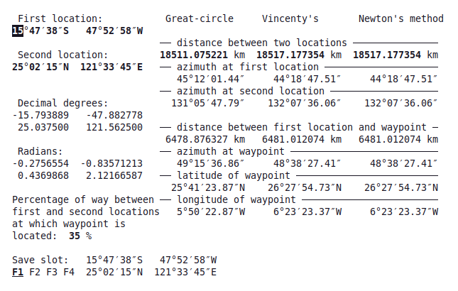

# Geodetic Solver

Small program with text-based interface ([ncurses](https://en.wikipedia.org/wiki/Ncurses)) that lets you primary calculate distances between locations on the globe. It uses 3 models of the Earth: spherical (geodesics are segments of great-circles), ellipsoid with calculations done using [Vincenty's formulae](https://en.wikipedia.org/wiki/Vincenty%27s_formulae) and ellipsoid with calculations done using Newton’s method ([Karney 2013](https://doi.org/10.1007/s00190-012-0578-z)).

Other functionalities include showing azimuths at both ends of geodesic and showing parameters of of waypoint lying on a geodesic (distance from first location, azimuth, latitude and longitude). There is a save feature that lets you store four pairs of locations so that they can be later used without entering them by hand.

## Program structure

* main.c – user interface and save function

* geodetic_solver.c and geodetic_solver.h – geodesic routines for spherical model and ellipsoid using improved Vincenty's formulae that now calculates correct distances (inverse geodesic problem) in all cases (azimuths can be incorrect for some nearly antipodal points)

* geodesic.c and geodesic.h – those files are copied from [geographiclib-c](https://github.com/geographiclib/geographiclib-c) and contain geodesic routines using Newton’s method ([Karney 2013](https://doi.org/10.1007/s00190-012-0578-z))

* saved_locations.txt – This file contains saved pairs  of locations, by default two of those make Vincenty's formulae fail at providing correct azimuths. If you don’t like provided locations just delete this file and a new one will be created when saving.

## Compilation

On a DEB based GNU/Linux distribution like Debian, Ubuntu or Linux Mint you can install tools necessary for compilation by executing following commands:

`sudo apt update`

`sudo apt install build-essential libncurses5-dev libncursesw5-dev`

On a RPM based distribution like Fedora you can install required tools  by executing following commands:

`yum makecache`

`sudo yum install gcc ncurses-devel`

You can then compile the program with this one (you need to be in the directory with source files):

`cc -Wall main.c geodetic_solver.c geodesic.c -lncursesw -lm -o geo`

Now you can run program (it needs executable permission `chmod a+x geo`):

`./geo`

## Usage of Geodetic Solver

* <kbd>Esc</kbd> or <kbd>Q</kbd> – exit program
* <kbd>→</kbd> - move active field to the right
* <kbd>←</kbd> - move active field to the left
* <kbd>Tab</kbd>, <kbd>Space</kbd>, <kbd>PgUp</kbd> or <kbd>PgDn</kbd> – go to the other line
* <kbd>Enter</kbd> – move active field to the right, when reaching over rightmost position go to the leftmost position of the other line
* <kbd>↑</kbd> - increment value of current active field or switch between N/S and E/W
* <kbd>↓</kbd> - decrement value of current active field or switch between N/S and E/W
* <kbd>0</kbd>-<kbd>9</kbd> – enter the value for the active field
* <kbd>Backspace</kbd> – clear active field
* <kbd>Delete</kbd> – clear all fields
* <kbd>F1</kbd>-<kbd>F4</kbd> – change current save slot
* <kbd>L</kbd> – load from current save slot
* <kbd>S</kbd> – save to current save slot
* <kbd>D</kbd> or <kbd>Home</kbd> – change between DMS and decimal degrees angle formats
* <kbd>E</kbd> – swap locations
* <kbd>+</kbd> - advance waypoint towards second location
* <kbd>-</kbd> - advance waypoint towards first location

Your terminal should have size of at least 24 lines and 80 columns.
